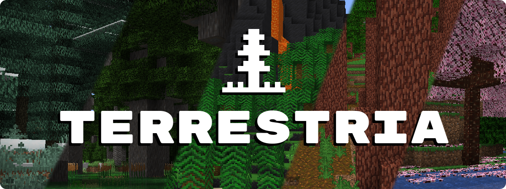
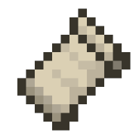
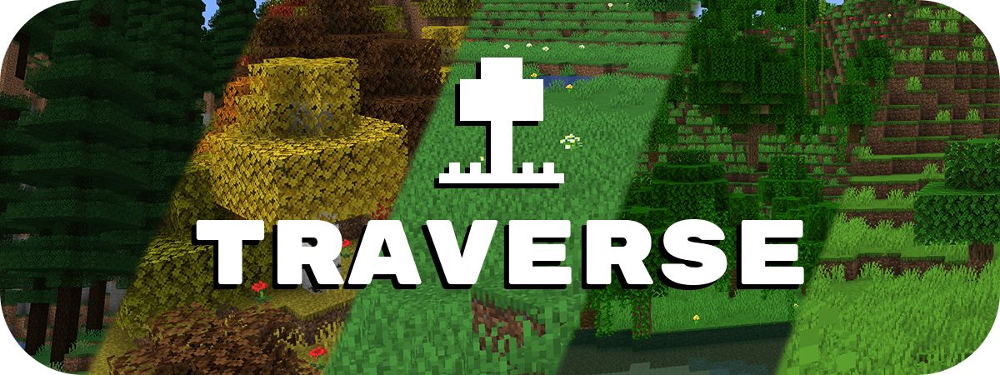
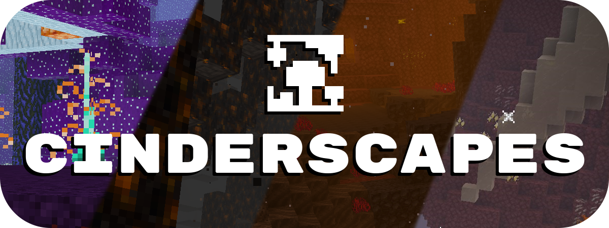
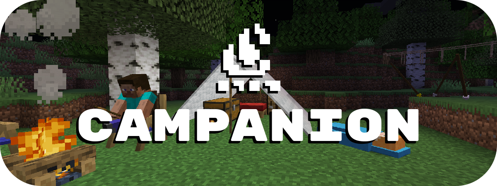

<b>NOTE</b>: Terrestria for 1.20+ no longer requires TerraBlender.

Terrestria is a detailed and vibrant biomes mod for Minecraft running on the Fabric mod loader. Terrestria enhances gameplay through the addition of 16 major biomes with several derivative biomes, 9 new wood types, as well as a healthy selection of foliage - providing a refreshing new selection of terrain.

<strong>Terrestria requires <a href="https://fabricmc.net/use/"></img> Fabric Loader and Fabric API</a></strong>

<strong>Check out the <a href="https://discord.gg/jEGF5fb">Terraformers Discord Server</a> to chat about Terrestria and other Fabric mods!</strong>

<strong style="font-size: 1.2rem;">Visit the <a href="https://github.com/TerraformersMC/Terrestria/wiki">Terrestria Wiki</a> to learn more about each biome</strong>

The goal of Terrestria is to be the most polished and visually appealing biomes mod available for Minecraft, and to this end there has been intense focus on selecting, detailing, and refining the biomes until they look absolutely amazing. Rather than add tons of different biomes, focus has been put into adding a rather small amount of biomes and then populating them with large amounts of detail. This overall results in a more cohesive experience compared to existing biome mods.

<h4 style="font-size: 18px; text-align: left;"><strong>Biomes:</strong></h4>
<h5 style="font-size: 14px;"><strong>v1.0.0 - Initial Release</strong></h5>
<ul>
	<li style="text-align: left;"><a href="https://github.com/TerraformersMC/Terrestria/wiki/Caldera">Caldera</a></li>
	<li style="text-align: left;"><a href="https://github.com/TerraformersMC/Terrestria/wiki/Cypress-Forest">Cypress Forest</a></li>
	<li style="text-align: left;"><a href="https://github.com/TerraformersMC/Terrestria/wiki/Cypress-Swamp">Cypress Swamp</a></li>
	<li style="text-align: left;"><a href="https://github.com/TerraformersMC/Terrestria/wiki/Dense-Woodlands">Dense Woodlands</a></li>
	<li style="text-align: left;"><a href="https://github.com/TerraformersMC/Terrestria/wiki/Hemlock-Rainforest">Hemlock Rainforest</a></li>
	<li style="text-align: left;"><a href="https://github.com/TerraformersMC/Terrestria/wiki/Japanese-Maple-Forest">Japanese Maple Forest</a></li>
	<li style="text-align: left;"><a href="https://github.com/TerraformersMC/Terrestria/wiki/Lush-Redwood-Forest">Lush Redwood Forest</a></li>
	<li style="text-align: left;"><a href="https://github.com/TerraformersMC/Terrestria/wiki/Rainbow-Rainforest">Rainbow Rainforest</a></li>
	<li style="text-align: left;"><a href="https://github.com/TerraformersMC/Terrestria/wiki/Redwood-Forest">Redwood Forest</a></li>
	<li style="text-align: left;"><a href="https://github.com/TerraformersMC/Terrestria/wiki/Sakura-Forest">Sakura Forest</a></li>
	<li style="text-align: left;"><a href="https://github.com/TerraformersMC/Terrestria/wiki/Snowy-Hemlock-Forest">Snowy Hemlock Forest</a></li>
	<li style="text-align: left;"><a href="https://github.com/TerraformersMC/Terrestria/wiki/Volcanic-Island">Volcanic Island</a></li>
</ul>
<h5><strong>v2.0.0 - The Dry Update</strong></h5>
<ul>
	<li style="text-align: left;"><a href="https://github.com/TerraformersMC/Terrestria/wiki/Canyon">Canyon</a></li>
	<li style="text-align: left;"><a href="https://github.com/TerraformersMC/Terrestria/wiki/Dunes">Dunes</a></li>
	<li style="text-align: left;"><a href="https://github.com/TerraformersMC/Terrestria/wiki/Lush-Desert">Lush Desert</a></li>
	<li style="text-align: left;"><a href="https://github.com/TerraformersMC/Terrestria/wiki/Oasis"><strike>Oasis</strike></a></li>
	<li style="text-align: left;"><a href="https://github.com/TerraformersMC/Terrestria/wiki/Outback">Outback</a></li>
</ul>

<strong>Some biomes contain variants to increase variety</strong>

<strong>Images of the biomes can be found on the <a href="https://www.curseforge.com/minecraft/mc-mods/terrestria/screenshots">Images page</a>.</strong>

 

<h4 style="text-align: left;"><strong>Other Mods by Terraformers:</strong></h4>

<strong>Check out Terrestria's sister mod, <a href="https://modrinth.com/mod/traverse">Traverse</a>:</strong>

Traverse works well alongside Terrestria if you are looking for a set of biomes that are closer to the Vanilla+ ideal. Traverse has a lot of unique, colorful biomes that embrace the simple vanilla aesthetic instead of trying to overshadow it.

<strong>Check out the Terraformers Nether biome expansion, <a href="https://modrinth.com/mod/cinderscapes">Cinderscapes</a>:</strong>

Cinderscapes complements Terrestria by providing an expansion to the nether, much like Terrestria does to the overworld. Cinderscapes brings more life and beauty to the nether, while also keeping it frightening.&nbsp;

<strong><a href="https://modrinth.com/mod/campanion">Campanion</a>, your camping companion:</strong>

Campanion adds various tools and utilities to help improve your adventures away from your home. Campanion also works well alongside Terrestria in order to make the exploration of the biomes even more fun.

 

<h5 style="text-align: center;">
	Terrestria is a mod for Fabric, and there are no plans to port this mod to Forge. 
	However, another team is maintaining a Forge fork of this mod at <a href="https://legacy.curseforge.com/minecraft/mc-mods/terrestria-reforged">Terrestria Reforged.</a> 
	Terrestria Reforged is unaffiliated with Terraformers, so please do not ask us for support regarding their mod.
</h5>
